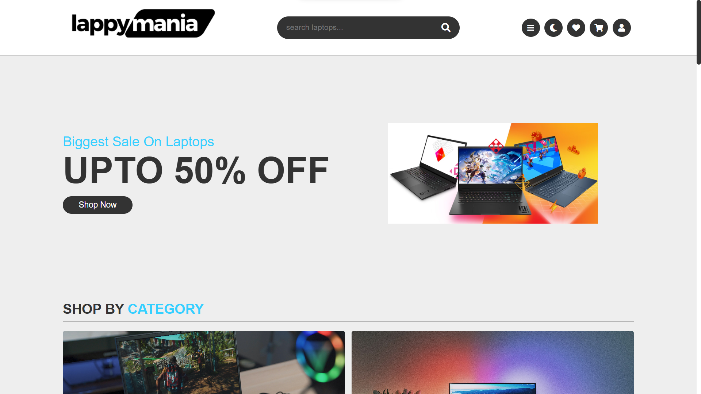
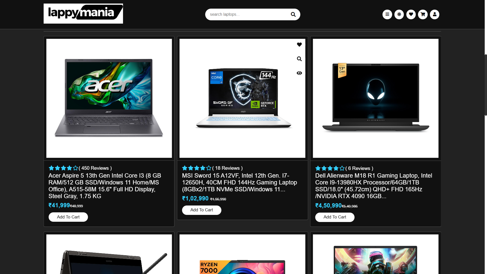
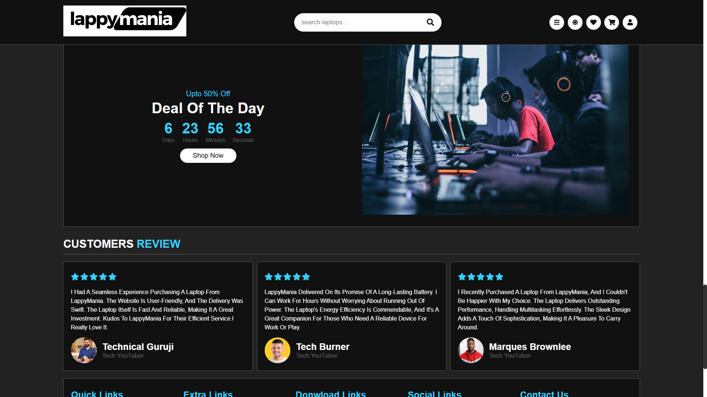

# 💻 LappyMania - Laptop Shopping Platform

LappyMania is a responsive laptop e-commerce website where users can explore, compare, and shop for laptops tailored to their specific needs—whether you're a gamer, student, or working professional. This platform includes modern UI components like sliders, featured deals, countdown offers, and customer testimonials, providing a smooth and engaging shopping experience.

---

## 🌐 Live Demo

> 🚀 [View Live Site](https://lappymania.vercel.app/)  

---

## 📸 Screenshots

| Home Page | Featured Section | Review Slider |
|-----------|------------------|----------------|
|  |  |  |

---

## 🛠️ Features

- 🔎 Search bar with icon
- 📱 Fully responsive UI
- 🌙 Light/Dark mode toggle
- 📦 Category-based product filtering
- 🖼️ Product sliders with Swiper.js
- ⏳ Deal of the Day countdown timer
- 💬 Customer reviews with carousel
- 🎯 Smooth scroll and sticky header
- 🧭 Navigation menu with toggle
- 💻 Multi-image switch in product preview
- 🛒 Add to cart functionality (UI-based)

---

## 🧰 Tech Stack

- **HTML5**
- **CSS3**
- **JavaScript (Vanilla)**
- **Swiper.js** – For sliders
- **Font Awesome** – For icons

---

## 📱 Responsive Design

The website is responsive across:

- ✅ Desktop
- ✅ Tablet
- ✅ Mobile

Built using custom media queries and Swiper's responsive breakpoints.

---

## 📅 Future Improvements

- 🧮 Add real-time cart & checkout flow
- 🔍 Implement detailed laptop comparison
- 🔐 Add user login/signup with authentication
- 🛠️ Integrate backend with a database for products

---

## 📜 License

This project is licensed under the [MIT License](LICENSE)

---

## ⭐ Show Your Support

If you liked this project, feel free to:

- ⭐ Star this repo
- 🍴 Fork it
- 🧠 Suggest improvements
